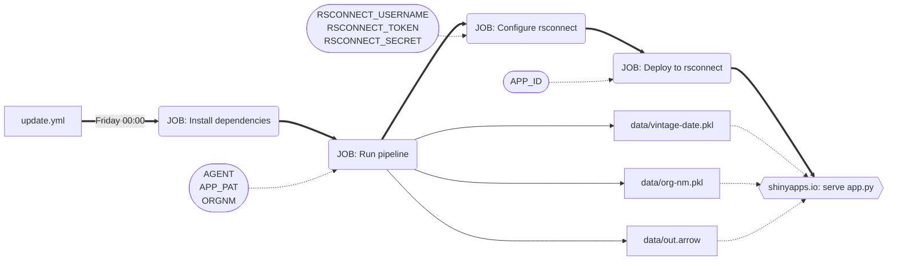

# org-issue-tool
View all open repository issues and PRs for an organisation - a precursor
bounty board.

A [python shiny application](https://richleysh84.shinyapps.io/org-bounty-board/)
displays the time it was updated, organisation name and open repository
metadata. This is deployed on a Friday at 00:00 with GitHub Actions.

## Workflow Guide

The [GitHub Actions workflow file](/./.github/workflows/update.yml) expects the
repository to have configured:

- environment variables
    - `RSCONNECT_USERNAME`
    - `ORGNM` (the organisation name to scrape issues/PRs)
- secrets
    - `AGENT` (an appropriate agent string)
    - `APP_PAT`
    - `RSCONNECT_TOKEN`
    - `RSCONNECT_SECRET`
    - `APP_ID`

Note the workflow deploys to an application called `org-bounty-board`.
